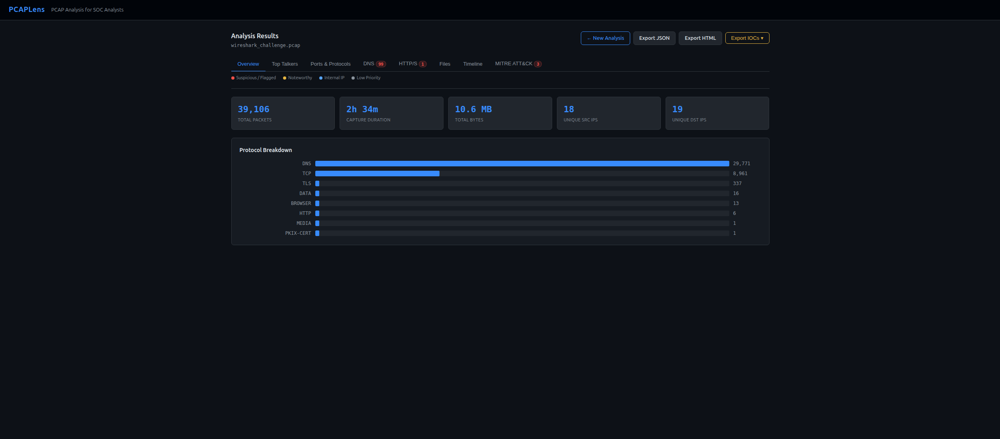
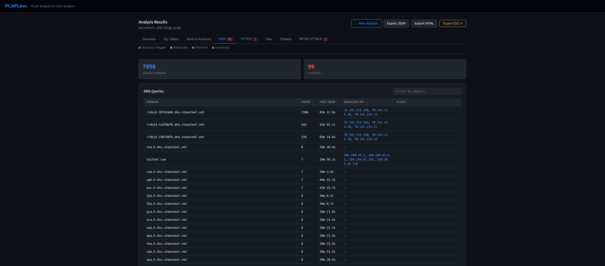
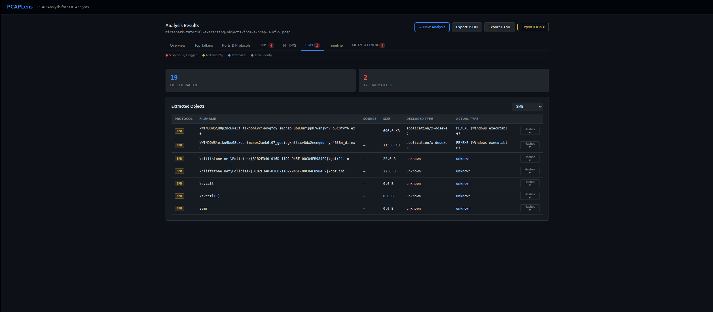
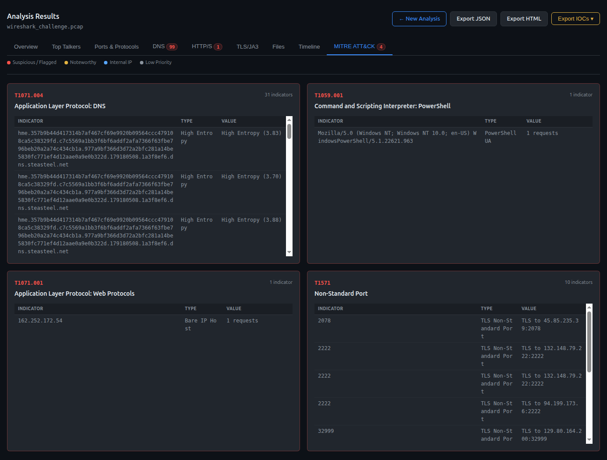

# PCAPLens

A self-hosted PCAP analysis tool built with Python and Flask. Designed for SOC analysts to upload and analyse PCAP/PCAPNG files locally, automating network forensics triage with MITRE ATT&CK mapping and IOC extraction.


## Why PCAPLens?

Wireshark is powerful but manual and time-consuming for triage. PCAPLens automates the repetitive parts of PCAP analysis — protocol breakdown, DNS flagging, file extraction, IOC collection — so analysts can focus on investigation rather than data wrangling. Everything runs locally with no cloud uploads.

## Features

- **Multi-tab analysis dashboard** — Nine dedicated tabs: Overview, Top Talkers, Ports & Protocols, DNS, HTTP/S, TLS/JA3, Files, Timeline, and MITRE ATT&CK
- **Protocol breakdown** — Packet counts and byte volume per protocol with visual bar charts
- **Top talker identification** — IP pair ranking with RFC 1918 internal IP detection and egress traffic flagging
- **Suspicious port detection** — Flags known suspicious ports (4444, 1337, 31337, 9001, 6667, etc.) with ephemeral port collapsing for noise reduction
- **DNS analysis** — Shannon entropy scoring for DGA detection, long subdomain flagging, bad TLD detection (.tk, .xyz, .pw, etc.), resolved IP extraction via tshark fallback, and sortable column headers
- **HTTP/S request inspection** — Response header correlation (status, Content-Type, Server), flagged user agents (PowerShell, curl, wget, python-requests, go-http-client), bare IP host detection, and Content-Type mismatch flagging
- **TLS/JA3 fingerprinting** — Extracts JA3/JA3S hashes from TLS handshakes, flags known malicious C2 fingerprints (Cobalt Strike, Sliver, Meterpreter, etc.), identifies scripting tool clients (PowerShell, curl, Python), detects missing SNI, rare JA3 hashes, non-standard ports, and legacy TLS versions
- **Multi-protocol file extraction** — Extracts objects from HTTP, SMB, and FTP streams via tshark with magic byte detection, MD5/SHA1/SHA256 hashing, type mismatch flagging, and protocol filter dropdown
- **MITRE ATT&CK mapping** — Ten technique detections with structured evidence tables showing indicators, types, and values
- **Event timeline** — Chronological view of security-relevant events with a colour-coded horizontal timeline bar, clickable markers, and category filtering (DNS, HTTP, TLS, Files, Suspicious, MITRE)
- **IOC export** — One-click export of actionable indicators (domains, IPs, hashes, JA3 fingerprints, user agents, MITRE techniques) in CSV or structured JSON format with base domain deduplication for DNS tunnelling indicators
- **Multiple report formats** — Full JSON export, self-contained HTML report (inline CSS, no external dependencies), and IOC bundles
- **Colour-coded triage system** — Red (suspicious/flagged), amber (noteworthy), blue (internal IP), grey (low priority)
- **Dark theme UI** — Purpose-built dark interface with monospace fonts for hash and IP readability

## Screenshots









## Installation

### Prerequisites

- Python 3.8+
- tshark (Wireshark CLI) — `sudo apt install tshark`
- pip

### Setup

```bash
git clone https://github.com/oliversweeney-cs/PCAPLens.git
cd PCAPLens
python3 -m venv venv
source venv/bin/activate
pip install -r requirements.txt
cp .env.example .env
# Edit .env and set FLASK_SECRET_KEY to a random string
python app.py
```

Open [http://localhost:8889](http://localhost:8889) in your browser.

## Usage

1. Navigate to the upload page at `http://localhost:8889`
2. Drag and drop a `.pcap` or `.pcapng` file (or click to browse)
3. Review the analysis dashboard across 8 tabs
4. Key things to look for:
   - Flagged DNS domains (high entropy, long subdomains, bad TLDs)
   - Suspicious port activity (Metasploit, IRC, Tor)
   - File type mismatches (magic bytes vs declared extension)
   - MITRE ATT&CK technique matches
   - Flagged user agents (PowerShell, scripting tools)
5. Export findings via JSON, HTML report, or IOC bundle (CSV/JSON) for ingestion into a SIEM or threat intel platform

## MITRE ATT&CK Coverage

| Technique ID | Name | Detection Logic |
|---|---|---|
| T1571 | Non-Standard Port | Traffic on known suspicious ports (4444, 1337, 31337, 9001, 9030, 6667, 4899) |
| T1071.004 | Application Layer Protocol: DNS | High-entropy subdomain labels or abnormally long subdomain strings |
| T1071.003 | Application Layer Protocol: IRC | Traffic observed on port 6667 |
| T1552.001 | Unsecured Credentials: Credentials In Files | HTTP Basic Auth headers transmitted in cleartext |
| T1059.001 | Command and Scripting Interpreter: PowerShell | PowerShell identified in HTTP User-Agent strings |
| T1071.001 | Application Layer Protocol: Web Protocols | HTTP requests sent to bare IP addresses instead of hostnames |
| T1036 | Masquerading | File magic bytes do not match declared extension or Content-Type header |
| T1021.002 | Remote Services: SMB/Windows Admin Shares | Executable files (PE/ELF/Mach-O) transferred via SMB |
| T1071.002 | Application Layer Protocol: File Transfer Protocols | Files transferred via FTP data streams |
| T1573.001 | Encrypted Channel: Symmetric Cryptography | TLS Client Hello JA3 hash matches known C2/malware fingerprint |

## Project Structure

```
pcaplens/
├── app.py                  # Flask routes, template filters, export endpoints
├── analysis/
│   ├── __init__.py         # Analysis orchestrator — runs all modules
│   ├── constants.py        # Suspicious ports, thresholds, magic bytes, MITRE definitions
│   ├── parser.py           # pyshark PCAP parsing into normalised packet dicts
│   ├── overview.py         # Packet counts, byte totals, protocol breakdown
│   ├── top_talkers.py      # IP pair ranking with RFC 1918 tagging
│   ├── ports.py            # Port analysis with ephemeral collapsing
│   ├── dns.py              # DNS query/response analysis with tshark fallback
│   ├── http.py             # HTTP request-response correlation and UA flagging
│   ├── files.py            # HTTP/SMB/FTP file extraction via tshark
│   ├── tls.py              # TLS/JA3 fingerprint extraction and flagging
│   ├── mitre.py            # Rule-based MITRE ATT&CK technique mapping
│   ├── timeline.py         # Chronological event collection from all modules
│   └── ioc_export.py       # IOC bundle generation (CSV and JSON)
├── templates/
│   ├── base.html           # Dark theme base layout
│   ├── index.html          # Upload page with drag-and-drop
│   ├── results.html        # Multi-tab analysis dashboard
│   └── export_report.html  # Self-contained HTML report template
├── uploads/                # Temporary PCAP storage (cleaned after analysis)
└── README.md
```

## Limitations

- **Upload only** — No live capture; works with saved PCAP/PCAPNG files
- **No VirusTotal integration yet** — Hashes are extracted for manual lookup or use with [ioc-enrich](https://github.com/oliversweeney-cs/ioc-enrich)
- **FTP extraction** — Depends on tshark's ability to reassemble FTP data streams from the capture
- **Single-user** — No authentication or case management
- **No TLS decryption** — Encrypted traffic analysis limited to metadata (SNI, JA3 not yet implemented)

## Roadmap

- VirusTotal hash lookup integration on Files tab
- PCAP upload size limits and progress indicators
- Sigma rule integration for detection logic

## Built With

- **Python** — Core language
- **Flask** — Web framework
- **pyshark** — PCAP parsing (Python wrapper for tshark)
- **tshark** — DNS response extraction and file object export

## Context

This project was built as part of my cybersecurity study journey while working through the [MYDFIR SOC Analyst Accelerator](https://www.mydfir.com/) program. PCAPLens is the third tool in a portfolio series alongside [PhishLens](https://github.com/oliversweeney-cs/PhishLens) (phishing email analysis) and [ioc-enrich](https://github.com/oliversweeney-cs/ioc-enrich) (IOC enrichment CLI), designed to replicate the network forensics triage workflow a SOC analyst performs when investigating suspicious packet captures.

## License

MIT License — see [LICENSE](LICENSE) for details.
